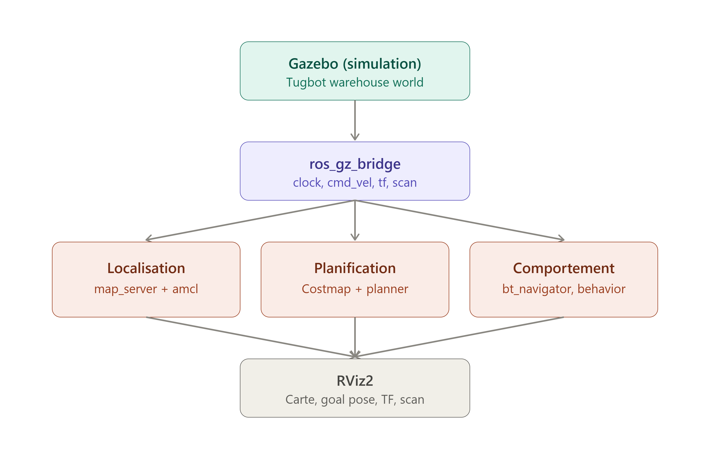
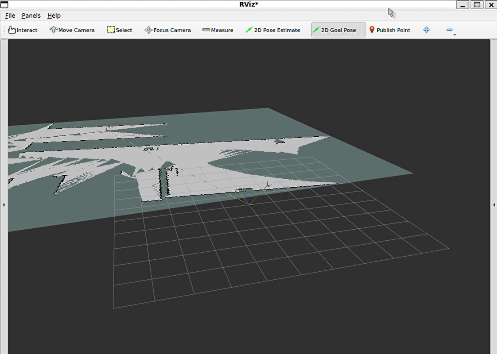
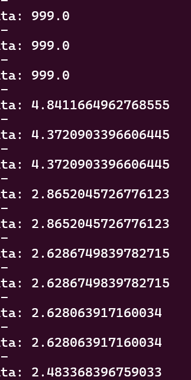
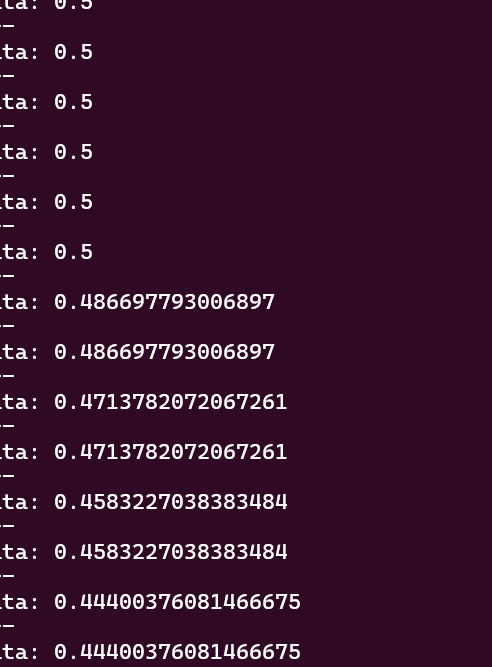

# Rapport de stage

## Intelligence artificielle et gestion adaptative du risque : application du critère de Kelly à la navigation autonome d'un robot mobile

---

**Établissement :** ENETCOM (École Nationale d'Électronique et des Télécommunications de Sfax)
**Filière :** Génie Télécommunication — 2ᵉ année (année universitaire 2026/2027)

**Entreprise d'accueil :** AUTRIS SAS
81 Rue de Silly, 92100 Boulogne-Billancourt, France
(stage réalisé en distanciel depuis Sfax, avec réunions en présentiel ponctuelles)

**Encadrant de stage :** Walid Ben Ayed — walid.benayed@autris.fr
**Stagiaire :** Mariem Ajili

**Période du stage :** 10 juillet – 31 août 2026

---

## Remerciements

Je tiens à remercier AUTRIS SAS pour l'opportunité qui m'a été donnée
d'effectuer ce stage à distance sur un sujet à la croisée de la finance
quantitative, de l'intelligence artificielle et de la robotique. Je
remercie tout particulièrement mon encadrant, M. Walid Ben Ayed, pour son
suivi régulier, sa disponibilité et ses conseils techniques tout au long
de ces huit semaines, malgré la distance. Je remercie également le corps
enseignant de l'ENETCOM pour la formation qui m'a permis d'aborder ce
projet dans de bonnes conditions.

---

## Résumé

Ce stage, réalisé au sein d'AUTRIS SAS, porte sur l'application du critère
de Kelly — un principe issu des mathématiques financières utilisé pour le
dimensionnement optimal d'une mise en pari ou en investissement — à la
navigation autonome d'un robot mobile. L'objectif est de permettre à un
robot d'adapter dynamiquement son comportement (vitesse, distance de
sécurité) en fonction d'un niveau de risque estimé à partir de ses données
de perception, plutôt que de suivre une politique de navigation figée.

Le travail s'est déroulé en deux phases. La première a consisté à mettre en
place une chaîne de navigation autonome classique, combinant cartographie
simultanée et localisation (SLAM, via `slam_toolbox`) et planification de
trajectoire (Nav2), sous ROS 2 Jazzy et Gazebo Harmonic. La seconde phase a
porté sur l'intégration d'un module de gestion adaptative du risque inspiré
du critère de Kelly, modulant en temps réel la vitesse maximale et la
distance de sécurité du robot via la reconfiguration dynamique des
paramètres de Nav2.

Une comparaison entre la navigation classique et la navigation
risque-adaptative a permis d'évaluer l'intérêt de cette approche pour la
sécurité de la navigation autonome.

**Mots-clés :** ROS 2, SLAM, Nav2, navigation autonome, critère de Kelly,
gestion du risque, robotique mobile.

---

## Abstract

This internship, carried out at AUTRIS SAS, addresses the application of
the Kelly criterion — a principle from financial mathematics used for
optimal bet/investment sizing — to the autonomous navigation of a mobile
robot. The goal is to let a robot dynamically adapt its behavior (speed,
safety distance) based on an estimated risk level derived from its sensor
data, rather than following a fixed navigation policy.

The work was carried out in two phases. The first consisted of setting up
a classic autonomous navigation pipeline, combining Simultaneous
Localization and Mapping (SLAM, via `slam_toolbox`) and path planning
(Nav2), under ROS 2 Jazzy and Gazebo Harmonic. The second phase focused on
integrating a risk-adaptive management module inspired by the Kelly
criterion, dynamically adjusting the robot's maximum speed and safety
distance through Nav2's dynamic parameter reconfiguration.

A comparison between classic and risk-adaptive navigation made it possible
to assess the value of this approach for the safety of autonomous
navigation.

**Keywords:** ROS 2, SLAM, Nav2, autonomous navigation, Kelly criterion,
risk management, mobile robotics.

---

## Sommaire

1. Introduction générale
2. Présentation de l'entreprise d'accueil — AUTRIS SAS
3. Contexte théorique
4. Environnement et outils
5. Méthodologie et réalisation
   5.1 Phase 1 — Navigation SLAM classique avec Nav2
   5.2 Phase 2 — Intégration du critère de Kelly
6. Résultats et comparaison
7. Discussion et limites
8. Conclusion et perspectives
9. Bibliographie
10. Annexes

---

## 1. Introduction générale

Dans le cadre de ma formation en Génie Télécommunication à l'ENETCOM, j'ai
effectué un stage au sein d'AUTRIS SAS, entreprise d'ingénierie spécialisée
dans les systèmes industriels, l'automatisation et la robotique
intelligente. Ce stage, d'une durée de huit semaines (10 juillet au 31 août
2026), s'est déroulé en distanciel depuis Sfax, avec des réunions de suivi
en présentiel.

Le sujet proposé par mon encadrant, M. Walid Ben Ayed, visait à établir un
pont entre un domaine que j'avais initialement exploré — la sécurité
financière — et la robotique autonome : appliquer le critère de Kelly,
formule de dimensionnement de mise utilisée en finance et en théorie de la
décision, à la gestion du risque dans la navigation d'un robot mobile
simulé.

L'objectif général du stage était double : d'une part, mettre en place une
chaîne de navigation autonome complète et fonctionnelle (cartographie,
localisation, planification de trajectoire) ; d'autre part, développer et
intégrer un mécanisme d'adaptation du comportement du robot au risque
perçu, puis comparer les performances de sécurité entre navigation
classique et navigation risque-adaptative.

---

## 2. Présentation de l'entreprise d'accueil — AUTRIS SAS

### 2.1 Présentation générale

AUTRIS SAS est une société française d'ingénierie spécialisée dans la
conception, le développement et l'intégration de solutions technologiques
destinées aux secteurs industriels. L'entreprise intervient principalement
dans les domaines de l'automatisation industrielle, de l'instrumentation,
des systèmes de contrôle-commande, de l'informatique industrielle, des
systèmes embarqués, de la robotique et de l'intelligence artificielle
appliquée aux systèmes industriels et autonomes.

Implantée en France, AUTRIS dispose également d'une filiale en Tunisie, lui
permettant de renforcer ses capacités d'ingénierie, de développement et de
recherche, tout en favorisant les collaborations avec les acteurs
industriels, les établissements d'enseignement supérieur et les structures
de recherche.

Grâce à une approche pluridisciplinaire associant automatisme,
informatique, instrumentation, électronique, intelligence artificielle et
robotique, AUTRIS accompagne ses partenaires dans les différentes phases de
leurs projets, depuis l'analyse des besoins et la conception jusqu'au
développement, à l'intégration, aux essais, à la mise en service et à la
validation des solutions mises en œuvre.

### 2.2 Domaines d'expertise

Les activités d'AUTRIS s'articulent autour de plusieurs domaines
complémentaires de l'ingénierie et des technologies avancées :

- **Automatisation industrielle** : étude et développement de systèmes
  automatisés, programmation d'automates industriels, intégration de
  systèmes de supervision et d'interfaces homme-machine, solutions de
  contrôle, d'acquisition et de traitement des données.
- **Instrumentation et contrôle-commande** : intégration de capteurs,
  d'actionneurs, de systèmes de mesure et de réseaux de communication
  industriels.
- **Systèmes embarqués, robotique mobile et intelligence artificielle** :
  perception de l'environnement, vision par ordinateur, fusion de données
  multi-capteurs, localisation, cartographie, navigation autonome,
  planification de trajectoires et prise de décision intelligente.

### 2.3 Recherche, développement et innovation

AUTRIS accorde une place importante aux activités de R&D, avec pour
objectif d'intégrer les technologies émergentes aux problématiques
industrielles et aux systèmes autonomes. Les travaux portent notamment sur
l'automatisation avancée, les systèmes intelligents, la robotique mobile
autonome, la perception multi-capteurs, la vision par ordinateur, la
fusion de données, le SLAM, la navigation intelligente, l'intelligence
artificielle embarquée ainsi que les méthodes d'apprentissage automatique,
d'apprentissage profond et d'apprentissage par renforcement.

La présence d'AUTRIS en France et en Tunisie contribue au développement de
collaborations entre le monde industriel et le milieu académique, et
permet de conduire des projets associant ingénierie, recherche appliquée,
expérimentation et développement de solutions innovantes.

### 2.4 Projets et réalisations

AUTRIS intervient sur des projets couvrant aussi bien les applications
industrielles que les systèmes intelligents et robotiques : modernisation
de systèmes d'acquisition de données, développement et migration de
systèmes SCADA, intégration d'automates programmables, développement
d'interfaces de supervision, intégration de capteurs et d'actionneurs,
projets dans les secteurs de l'énergie, du pétrole et du gaz (automatisation,
supervision, pré-commissioning, commissioning), ainsi que des projets de
R&D en intelligence artificielle et robotique : navigation autonome des
robots mobiles, fusion de données LiDAR-caméra, perception de
l'environnement, SLAM, détection et suivi d'obstacles, planification de
trajectoires et apprentissage par renforcement appliqué à la navigation et
à la prise de décision.

C'est dans ce dernier axe de R&D que s'inscrit le présent stage.

---

## 3. Contexte théorique

### 3.1 Le critère de Kelly

Le critère de Kelly a été formulé par John L. Kelly Jr. (Bell Labs, 1956)
pour déterminer la fraction optimale d'un capital à engager dans un pari
ou un investissement répété, de manière à maximiser la croissance
logarithmique du capital sur le long terme tout en évitant la ruine. Dans
sa forme généralisée, la formule s'écrit :

```
f* = p/L - q/G
```

où `p` est la probabilité de succès, `q = 1 - p` la probabilité d'échec,
`L` la fraction du capital perdue en cas d'échec, `G` la fraction du
capital gagnée en cas de succès, et `f*` la fraction optimale du capital à
engager. (Le cas particulier `L = 1`, c'est-à-dire une perte totale du
capital engagé en cas d'échec, redonne la forme la plus couramment citée
`f* = p - q/G`.)

### 3.2 Adaptation à la navigation autonome

Ce stage propose une transposition de ce principe à la navigation d'un
robot mobile : la vitesse (ou plus largement l'agressivité du comportement
du robot) est traitée comme une "mise", la probabilité `p` comme la
probabilité estimée d'une trajectoire sûre (déduite des données
capteurs), et la fraction de Kelly `f*` comme la fraction de la vitesse
maximale nominale que le robot est autorisé à utiliser à un instant donné.

Il n'existe pas, à notre connaissance, de formalisation standard d'un
"critère de Kelly" propre à la robotique dans la littérature ; il s'agit
donc d'un choix de modélisation propre à ce travail, détaillé en section
5.2, qu'il conviendra de situer par rapport aux approches existantes de
navigation prenant en compte l'incertitude (voir section 9).

### 3.3 SLAM et navigation autonome (Nav2)

La cartographie et localisation simultanées (SLAM — *Simultaneous
Localization and Mapping*) permettent à un robot de construire une carte
de son environnement tout en s'y localisant, sans connaissance préalable
de cet environnement. Le package `slam_toolbox`, utilisé dans ce projet,
implémente cette fonctionnalité sous ROS 2.

La pile de navigation Nav2 (Navigation2) fournit les briques nécessaires à
la navigation autonome : planification globale de trajectoire, suivi de
trajectoire local (ici via le contrôleur MPPI — *Model Predictive Path
Integral*), gestion des costmaps (représentation des obstacles et zones de
sécurité) et orchestration via un arbre de comportement (*behavior tree*).

---

## 4. Environnement et outils

| Composant | Choix retenu |
|---|---|
| Système d'exploitation | Ubuntu 24.04 (sous WSL2) |
| Framework robotique | ROS 2 Jazzy |
| Simulateur | Gazebo Harmonic |
| Robot simulé | tugbot (après plusieurs tentatives sur TurtleBot4, TurtleBot3 Burger et iRobot Create3 — voir section 5.1.1) |
| Cartographie | `slam_toolbox` |
| Navigation | Nav2 (contrôleur MPPI) |
| Visualisation | RViz2 |
| Gestion de session | tmux (scripts de lancement automatisés) |
| Langage de développement | Python (rclpy) |
| Enregistrement de démonstration | OBS Studio |

---

## 5. Méthodologie et réalisation

### 5.1 Phase 1 — Navigation SLAM classique avec Nav2

#### 5.1.1 Mise en place de l'environnement de simulation

La mise en place de l'environnement de simulation a représenté une part
importante et imprévue du travail. Plusieurs plateformes robotiques ont été
successivement testées avant d'aboutir à une configuration stable :

- **TurtleBot4** (sous ROS 2 Jazzy) : abandonné après une semaine
  d'essais infructueux — modèles 3D (meshes) non chargés par Gazebo,
  erreurs sur l'arbre de transformations (TF tree, repère parent
  introuvable pour la caméra Kinect).
- **TurtleBot3 Burger** : solution de repli fonctionnelle rapidement (LiDAR
  et affichage opérationnels dès les premiers essais), mais jugée trop
  simpliste ("plateforme grand public") pour les objectifs du stage.
- **iRobot Create3** : plusieurs blocages résolus successivement (échec
  des serveurs Fuel pour le téléchargement des décors, conflit de
  commandes sur `/cmd_vel` lors du pilotage manuel, LiDAR non détecté par
  défaut nécessitant une configuration manuelle des bridges de
  communication ROS 2 ↔ Gazebo), avant qu'un problème de performance
  majeur n'apparaisse : facteur temps réel (RTF) de l'ordre de 0.01, soit
  environ cent fois plus lent que le temps réel, causé par l'absence
  d'accélération GPU pour le rendu du LiDAR sous WSL2.
- **tugbot** : robot finalement retenu, offrant une simulation stable et
  performante, sur lequel l'ensemble du reste du projet a été développé.

Cette phase exploratoire, bien que non prévue dans le plan de travail
initial, a représenté un apprentissage significatif en matière de
diagnostic et de résolution de problèmes système sous ROS 2/Gazebo.

#### 5.1.2 Architecture de la chaîne de simulation

La chaîne de simulation repose sur les éléments suivants :

- **Gazebo Harmonic**, exécutant le monde simulé (entrepôt), avec le robot
  tugbot ;
- des **bridges ROS 2 ↔ Gazebo** (`ros_gz_bridge`) exposant les topics
  `/clock`, `/cmd_vel`, `/tf`, `/scan` et `/odom` côté ROS 2 ;
- un **static transform publisher** reliant le repère `base_link` au
  repère du LiDAR ;
- `slam_toolbox`, en charge de la construction de la carte à partir du
  scan LiDAR et de l'odométrie ;
- **Nav2** (`controller_server`, `planner_server`, `bt_navigator`,
  `behavior_server`, `smoother_server`, costmaps local et global),
  assurant la planification et le suivi de trajectoire ;
- **RViz2**, pour la visualisation et l'envoi d'objectifs de navigation
  ("2D Goal Pose").



*Figure 1 : chaîne de simulation et de navigation — Gazebo alimente les
topics ROS 2 via `ros_gz_bridge` (clock, cmd_vel, tf, scan), qui
alimentent en parallèle la localisation (`map_server`/`amcl` ou
`slam_toolbox`), la planification (costmap + planner) et la gestion du
comportement (`bt_navigator`, behavior server) ; RViz2 permet la
visualisation et l'envoi d'objectifs. En Phase 2, le nœud `kelly_monitor_node`
(non représenté ici) s'intercale en lecture sur `/scan` et `/odom`, et agit
sur le bloc Planification via reconfiguration dynamique des paramètres
(vitesse max, rayon d'inflation).

#### 5.1.3 Difficultés techniques rencontrées et résolues

- **Repère `base_footprint` vs `base_link`** : incohérence de
  configuration corrigée dans les paramètres Nav2.
- **Configuration MPPI trop lourde pour WSL2** : allégement des
  paramètres du contrôleur, fréquence de contrôle remontée à
  environ 20 Hz pour une exécution fluide.
- **Pose initiale AMCL** : le repère `map` n'est publié qu'après réception
  d'une pose initiale (`2D Pose Estimate` dans RViz ou message
  `/initialpose`) — un délai trop important entre le lancement de la pile
  et l'envoi de cette pose provoque un timeout du gestionnaire de cycle de
  vie (*lifecycle manager*) de Nav2.

#### 5.1.4 Résultats de la Phase 1

- Carte de l'environnement (entrepôt simulé) construite avec succès et
  sauvegardée.



*Figure 2 : carte de l'entrepôt en cours de construction dans RViz2 via
`slam_toolbox`, avec la trajectoire parcourue par le robot visible en
pointillés.*

- Navigation autonome fonctionnelle vers un objectif défini dans RViz,
  avec planification et suivi de trajectoire corrects.
- Test d'évitement d'obstacles réussi (contournement d'une étagère).
- Vidéo de démonstration enregistrée.

*(nœuds/topics principaux identifiés : `/scan`, `/odom`, `/tf`, `/map`,
`/cmd_vel`, `/global_costmap/costmap`, `/local_costmap/costmap`,
`controller_server`, `planner_server`, `bt_navigator`, `map_server`,
`amcl` / `slam_toolbox` — liste complète à détailler en annexe si besoin)*

### 5.2 Phase 2 — Intégration du critère de Kelly

#### 5.2.1 Choix de modélisation

Le critère de Kelly a été adapté à la navigation selon la correspondance
suivante :

| Finance | Navigation |
|---|---|
| Capital à miser | Vitesse maximale autorisée |
| Probabilité de succès `p` | Probabilité de trajectoire sûre (estimée à partir du LiDAR) |
| Fraction perdue en cas d'échec `L` | Sévérité potentielle d'une collision (ex. arrêt d'urgence, perte de temps/dégâts) |
| Fraction gagnée en cas de succès `G` | Bénéfice relatif d'une navigation rapide (gain de temps) |
| Fraction misée `f*` | Fraction de la vitesse nominale maximale utilisée |

La probabilité `p` est calculée à partir de deux indicateurs de risque,
chacun interpolé linéairement entre un seuil critique (`p = 0`) et un
seuil jugé sûr (`p = 1`), le minimum des deux étant retenu :

- la **distance minimale** aux obstacles détectés par le LiDAR dans un
  cône avant (120° par défaut) ;
- le **temps avant collision estimé** (TTC), calculé comme le rapport
  entre cette distance minimale et la vitesse courante du robot.

La fraction de Kelly obtenue, `f* = p/L - q/G` (avec `q = 1-p`), module
ensuite en temps réel :

- la **vitesse maximale** transmise au contrôleur MPPI de Nav2
  (paramètre `FollowPath.vx_max`) ;
- le **rayon d'inflation** du costmap local (paramètre
  `inflation_layer.inflation_radius`), c'est-à-dire la distance de
  sécurité maintenue autour des obstacles.

#### 5.2.2 Implémentation

Un package ROS 2 (`kelly_nav`) a été développé, contenant un nœud
(`kelly_monitor_node`) qui :

- s'abonne aux topics `/scan` et `/odom` pour estimer le risque en continu ;
- publie des topics de diagnostic (`/kelly/p_safe`, `/kelly/fraction`,
  `/kelly/ttc`, `/kelly/min_distance`, `/kelly/applied_vmax`,
  `/kelly/applied_inflation`) permettant le suivi et l'enregistrement des
  données pour analyse ;
- reconfigure dynamiquement les paramètres de Nav2 via les services ROS 2
  `set_parameters`, sans nécessiter de redémarrage de la pile de
  navigation.

Un mode "observation seule" (sans application des paramètres) a été prévu
pour valider le calcul du risque avant d'agir sur la navigation.

#### 5.2.3 Adaptation de l'infrastructure existante

L'intégration de cette phase a nécessité deux évolutions de la chaîne mise
en place en Phase 1 :

- passage de la localisation sur carte statique (`map_server` + AMCL) à
  `slam_toolbox` en **mode localisation**, permettant de conserver la
  carte déjà construite tout en l'étendant automatiquement aux nouvelles
  zones explorées par le robot ;
- passage du costmap global en mode **fenêtre glissante**
  (`rolling_window`), pour permettre la planification de trajectoires
  vers des objectifs situés au-delà des limites de la carte initiale.

---

## 6. Résultats et comparaison

### 6.1 Protocole de comparaison

La comparaison entre navigation classique (Nav2 seul) et navigation
risque-adaptative (Nav2 + `kelly_nav`) a été réalisée sur un même scénario
de test (entrepôt simulé, mêmes obstacles, même objectif de navigation),
selon les indicateurs suivants :

- temps total pour atteindre l'objectif ;
- distance minimale observée aux obstacles au cours de la trajectoire ;
- comportement du robot à l'approche d'un obstacle (ralentissement,
  augmentation de la distance de sécurité).

### 6.2 Résultats observés

La navigation risque-adaptative a été testée avec des seuils ajustés
(`d_safe = 3.0 m`, `ttc_safe = 6.0 s`, `kelly_b = 0.6`) permettant
d'observer un ralentissement net et une augmentation de la distance de
sécurité à l'approche d'obstacles. Ce comportement a été confirmé par le
suivi en direct des topics `/kelly/min_distance` et `/kelly/applied_vmax` :
lors des premiers tests (seuils par défaut), une réduction de la vitesse
appliquée d'environ 12 % (de 0.5 à ~0.44 m/s) a été mesurée à l'approche
d'un obstacle situé à quelques mètres ; après ajustement des seuils pour
les rendre plus sensibles, l'effet est devenu nettement plus marqué et
visible à l'écran, comme le montre la vidéo de démonstration finale, où le
robot ralentit visiblement à l'approche des étagères de l'entrepôt tout en
maintenant une distance de sécurité accrue par rapport à la navigation
classique observée en Phase 1.



*Figure 3 : relevé en direct du topic `/kelly/min_distance` — la distance
à l'obstacle diminue progressivement (de 999 m, valeur par défaut hors
détection, jusqu'à environ 2.5 m) à mesure que le robot s'en approche.*



*Figure 4 : relevé en direct du topic `/kelly/applied_vmax` sur la même
période — la vitesse maximale appliquée diminue de 0.5 m/s à environ
0.44 m/s de façon corrélée à la réduction de la distance à l'obstacle
observée en Figure 3, confirmant le fonctionnement de la reconfiguration
dynamique du critère de Kelly.*

Vidéo de démonstration (navigation avec critère de Kelly actif, seuils
ajustés) : `screenshots/simulation_kelly_c.mp4`

---

## 7. Discussion et limites

Le choix de modélisation retenu pour adapter le critère de Kelly à la
navigation — bien que cohérent avec la formule originale et avec les
objectifs du sujet — reste une interprétation parmi d'autres possibles.
D'autres formulations pourraient être envisagées, notamment en intégrant
plusieurs sources de risque simultanément (incertitude de localisation,
densité d'obstacles, vitesse relative d'obstacles dynamiques) ou en
calibrant les paramètres L et G à partir de données réelles plutôt que
d'un choix arbitraire.

La limite principale de l'approche réside dans la sensibilité du
comportement du robot aux seuils choisis (`d_safe`, `ttc_critical`,
`kelly_b`), qui ont dû être ajustés empiriquement pour obtenir un effet
visible et exploitable en démonstration, sans validation statistique
rigoureuse sur un grand nombre d'essais.

Par ailleurs, l'essentiel du temps du stage (plus de trois semaines) a été
consacré à la stabilisation de l'environnement de simulation plutôt qu'au
développement algorithmique proprement dit, ce qui a réduit le temps
disponible pour explorer des variantes du critère de Kelly ou pour
effectuer une évaluation quantitative plus poussée.

---

## 8. Conclusion et perspectives

Ce stage a permis de mettre en place une chaîne complète de navigation
autonome (SLAM + Nav2) pour un robot mobile simulé, puis d'y intégrer un
mécanisme original de gestion adaptative du risque inspiré du critère de
Kelly, modulant en temps réel la vitesse et la distance de sécurité du
robot en fonction du danger perçu.

Au-delà du résultat technique, ce travail a permis de développer des
compétences en robotique (ROS 2, SLAM, Nav2), en simulation (Gazebo), en
développement Python, ainsi qu'en résolution de problèmes système, la
majeure partie du stage ayant nécessité un travail approfondi de diagnostic
et de dépannage d'environnement.

Les perspectives d'amélioration incluent une évaluation quantitative plus
poussée (statistiques sur un grand nombre de trajectoires), l'intégration
de sources de risque supplémentaires (incertitude de localisation,
obstacles dynamiques), ainsi qu'un test sur robot physique pour valider la
transférabilité de l'approche au-delà de la simulation.

---

## 9. Bibliographie

### Critère de Kelly

- Kelly, J. L. Jr. (1956). *A New Interpretation of Information Rate*. Bell
  System Technical Journal, 35(4), 917-926.
  https://doi.org/10.1002/j.1538-7305.1956.tb03809.x
- MacLean, L. C., Thorp, E. O., & Ziemba, W. T. (2010). *The Kelly Capital
  Growth Investment Criterion: Theory and Practice*. World Scientific.
  (ouvrage de référence synthétisant les développements et applications du
  critère depuis 1956)
- *Kelly Criterion: The Math of Gambling, Proebsting's Paradox, and the
  Stock Market* [Vidéo]. YouTube.
  https://www.youtube.com/watch?v=x9EuFSTnXOE
  (support de vulgarisation utilisé en complément pour la préparation de
  la présentation initiale du sujet)
- Synopsys. *Reinforcement Learning Explained in 90 Seconds* [Vidéo].
  YouTube. https://www.youtube.com/watch?v=C2zw2H1c5Fk
  (support de vulgarisation sur les principes de l'apprentissage par
  renforcement, cité dans le sujet de stage initial)

### Kelly et intelligence artificielle / apprentissage par renforcement

- *Reinforcement Learning with Kelly Criterion for Optimal Portfolio
  Management of AAPL Stock*. Procedia Computer Science, 2025.
  https://doi.org/10.1016/j.procs.2025.03.166
  (illustre l'intégration du critère de Kelly comme mécanisme de
  dimensionnement d'action au sein d'un agent d'apprentissage par
  renforcement — principe transposé dans ce stage au dimensionnement de la
  vitesse du robot)
- *The Reinforcement Learning Kelly Strategy*. University of Waterloo
  (UWSpace). https://uwspace.uwaterloo.ca/bitstreams/51b3b16e-e397-47bf-9b38-7bf2d55b629e/download
- *Reinforcement Learning Explained in 90 Seconds* [Vidéo]. Synopsys,
  YouTube. https://www.youtube.com/watch?v=C2zw2H1c5Fk
  (support de vulgarisation utilisé pour une présentation rapide des
  principes de l'apprentissage par renforcement)

### Navigation robotique sensible au risque (état de l'art)

- Guo, B., Wang, G., Chen, Y., Gao, Y., & Xie, Q. (2025). *Risk-Aware
  Reinforcement Learning with Dynamic Safety Filter for Collision Risk
  Mitigation in Mobile Robot Navigation*. Sensors, 25(17), 5488.
  https://doi.org/10.3390/s25175488
- Sun, Z., Diao, X., Wang, Y., Zhu, B.-K., & Wang, J. (2025). *Socially
  Aware Robot Crowd Navigation via Online Uncertainty-Driven Risk
  Adaptation*. https://arxiv.org/abs/2506.14305
  (exemples d'approches de navigation intégrant une notion de risque
  estimé pour moduler le comportement du robot, dans un esprit proche —
  bien que par des méthodes différentes — de l'approche développée dans ce
  stage)

### Outils et frameworks utilisés

- Open Robotics. *ROS 2 Jazzy Jalisco Documentation*.
  https://docs.ros.org/en/jazzy/
- Macenski, S., Martín, F., White, R., & Ginés Clavero, J. (2020). *The
  Marathon 2: A Navigation System*. IEEE/RSJ International Conference on
  Intelligent Robots and Systems (IROS). https://arxiv.org/abs/2003.00368
  — voir aussi la documentation officielle : https://docs.nav2.org/
- Macenski, S., & Jambrecic, I. (2021). *SLAM Toolbox: SLAM for the
  dynamic world*. Journal of Open Source Software, 6(61), 2783.
  https://doi.org/10.21105/joss.02783
  — dépôt : https://github.com/SteveMacenski/slam_toolbox
- Open Robotics. *Gazebo Harmonic Documentation*.
  https://gazebosim.org/docs/harmonic

---

## 10. Annexes

- Annexe A — Code source du package `kelly_nav` :
  https://github.com/mariemajili08-star/kelly-nav-slam
- Annexe B — Liste des nœuds et topics ROS 2 utilisés (relevé réel via
  `ros2 node list` / `ros2 topic list` pendant les tests) :

  **Nœuds principaux**
  - `controller_server`, `planner_server`, `bt_navigator`,
    `behavior_server`, `smoother_server`, `velocity_smoother` (pile Nav2,
    hébergés dans un conteneur de composants)
  - `map_server` (Phase 1, carte statique) / `sync_slam_toolbox_node`
    (Phase 2, mode localisation avec extension de carte)
  - `amcl` (Phase 1) — remplacé en Phase 2 par la localisation intégrée
    de `slam_toolbox`
  - `local_costmap`, `global_costmap`
  - `kelly_monitor_node` (Phase 2, package `kelly_nav`)
  - `rviz2`

  **Topics principaux**
  - Perception / état : `/scan`, `/odom`, `/tf`, `/tf_static`, `/clock`
  - Cartographie et localisation : `/map`, `/map_metadata`,
    `/map_updates`, `/pose`, `/initialpose`
  - Navigation : `/cmd_vel`, `/goal_pose`, `/plan` (via `planner_server`),
    `/global_costmap/costmap`, `/local_costmap/costmap` (et topics
    associés `_raw`, `_updates`, `_raw_updates`)
  - Diagnostic / système : `/diagnostics`, `/rosout`, `/parameter_events`,
    `/bond`
  - Phase 2 (module `kelly_nav`) : `/kelly/p_safe`, `/kelly/fraction`,
    `/kelly/ttc`, `/kelly/min_distance`, `/kelly/applied_vmax`,
    `/kelly/applied_inflation`
  - SLAM (Phase 2) : `/slam_toolbox/feedback`,
    `/slam_toolbox/graph_visualization`, `/slam_toolbox/scan_visualization`,
    `/slam_toolbox/update`

- Annexe C — Captures d'écran RViz / Gazebo supplémentaires — voir le
  dossier `screenshots/` du dépôt GitHub (Annexe A).
